# pyos

## Summary

pyos is the backend control plane for abcdesktop. It exposes a CherryPy HTTP API used to authenticate users, create, resume, and remove cloud desktops, launch applications within those desktops, manage user desktops, and perform operator actions.

At runtime, pyos mediates between:

- Clients (web frontend and admin tools)
- Identity providers (OAuth2, LDAP/AD, anonymous, prelogin/logmein flows)
- Infrastructure services (Kubernetes, MongoDB, Memcached, DNS helpers)

The main service process is started by `od.py` and mounts API endpoints under `/API`.

## Flowchart

The principal workflow is an API client authenticating through configured providers, receiving JWT-based identity, opening an application, and obtaining desktop/application routing backed by Kubernetes. Controllers also expose management, application catalog, datastore, configuration, messaging, accounting, user, and store operations. 

``` mermaid
---
config:
  theme: redux
---
flowchart TD

subgraph group_api["API Surface"]
  node_auth_api["Authentication API<br/>[auth_controller.py]"]
  node_composer_api["Composer API"]
  node_core_api["Core API<br/>[core_controller.py]"]
  node_manager_api["Manager API"]
  node_user_api["User API<br/>[user_controller.py]"]
  node_store_api["Store API"]
  node_accounting_api["Accounting API"]
end

subgraph group_identity["Identity Security"]
  node_request_security["Request Security<br/>[base_controller.py]"]
  node_auth_service["Authentication Service<br/>[authservice.py]"]
  node_auth_managers["Provider Managers<br/>[authmanager.py]"]
  node_token_service["JWT Token Service<br/>[jwt.py]"]
  node_desktop_keys["Desktop Key Manager<br/>[keymanager.py]"]
end

subgraph group_desktop["Desktop Orchestration"]
  node_composer["Application Composer<br/>[composer.py]"]
  node_orchestrator["Kubernetes Orchestrator<br/>[orchestrator.py]"]
end

subgraph group_management["Management Data"]
  node_app_catalog[("Application Catalog<br/>[apps.py]")]
  node_manager_services["Management Services<br/>[services.py]"]
  node_message_info["Message Information<br/>[messageinfo.py]"]
end

subgraph group_platform["Platform State"]
  node_share_cache[("Shared Cache<br/>[sharecache.py]")]
  node_datastore[("Control Datastore<br/>[datastore.py]")]
  node_settings["Platform Settings<br/>[settings.py]"]
end

node_client(("API Client"))
node_directory[("Identity Directory")]
node_kubernetes{{"Kubernetes Cluster"}}
node_api_result["API Result"]

node_client -->|"authenticates"| node_auth_api
node_auth_api -->|"checks access"| node_request_security
node_auth_api -->|"dispatches login"| node_auth_service
node_auth_service -->|"selects provider"| node_auth_managers
node_auth_managers -.->|"queries identity"| node_directory
node_auth_service -->|"creates JWT"| node_token_service
node_auth_api -->|"returns token"| node_api_result
node_client -->|"opens application"| node_composer_api
node_composer_api -->|"validates request"| node_request_security
node_composer_api -->|"opens app"| node_composer
node_composer -->|"resolves app"| node_app_catalog
node_composer -->|"starts workload"| node_orchestrator
node_orchestrator -->|"manages pods"| node_kubernetes
node_orchestrator -->|"issues desktop key"| node_desktop_keys
node_desktop_keys -->|"stores private key"| node_share_cache
node_composer_api -->|"returns routing"| node_api_result
node_client -->|"requests metadata"| node_core_api
node_core_api -->|"validates request"| node_request_security
node_core_api -->|"pops messages"| node_message_info
node_core_api -->|"reads configuration"| node_settings
node_core_api -->|"returns response"| node_api_result
node_client -->|"manages platform"| node_manager_api
node_manager_api -->|"checks permission"| node_request_security
node_manager_api -->|"reads writes data"| node_datastore
node_manager_api -->|"updates applications"| node_app_catalog
node_manager_api -->|"runs maintenance"| node_manager_services
node_manager_services -->|"updates messages"| node_message_info
node_manager_api -->|"returns management"| node_api_result
node_client -->|"uses user API"| node_user_api
node_client -->|"uses store API"| node_store_api
node_client -->|"uses accounting API"| node_accounting_api

click node_auth_api "https://github.com/abcdesktopio/pyos/blob/4.4/controllers/auth_controller.py"
click node_composer_api "https://github.com/abcdesktopio/pyos/blob/4.4/controllers/composer_controller.py"
click node_core_api "https://github.com/abcdesktopio/pyos/blob/4.4/controllers/core_controller.py"
click node_manager_api "https://github.com/abcdesktopio/pyos/blob/4.4/controllers/manager_controller.py"
click node_user_api "https://github.com/abcdesktopio/pyos/blob/4.4/controllers/user_controller.py"
click node_store_api "https://github.com/abcdesktopio/pyos/blob/4.4/controllers/store_controller.py"
click node_accounting_api "https://github.com/abcdesktopio/pyos/blob/4.4/controllers/accounting_controller.py"
click node_request_security "https://github.com/abcdesktopio/pyos/blob/4.4/oc/od/base_controller.py"
click node_auth_service "https://github.com/abcdesktopio/pyos/blob/4.4/oc/auth/authservice.py"
click node_auth_managers "https://github.com/abcdesktopio/pyos/blob/4.4/oc/auth/authmanager.py"
click node_token_service "https://github.com/abcdesktopio/pyos/blob/4.4/oc/auth/jwt.py"
click node_desktop_keys "https://github.com/abcdesktopio/pyos/blob/4.4/oc/auth/keymanager.py"
click node_share_cache "https://github.com/abcdesktopio/pyos/blob/4.4/oc/sharecache.py"
click node_composer "https://github.com/abcdesktopio/pyos/blob/4.4/oc/od/composer.py"
click node_orchestrator "https://github.com/abcdesktopio/pyos/blob/4.4/oc/od/orchestrator.py"
click node_app_catalog "https://github.com/abcdesktopio/pyos/blob/4.4/oc/od/apps.py"
click node_datastore "https://github.com/abcdesktopio/pyos/blob/4.4/oc/datastore.py"
click node_manager_services "https://github.com/abcdesktopio/pyos/blob/4.4/oc/od/services.py"
click node_message_info "https://github.com/abcdesktopio/pyos/blob/4.4/oc/od/messageinfo.py"
click node_settings "https://github.com/abcdesktopio/pyos/blob/4.4/oc/od/settings.py"

classDef toneNeutral fill:#f8fafc,stroke:#334155,stroke-width:1.5px,color:#0f172a
classDef toneBlue fill:#dbeafe,stroke:#2563eb,stroke-width:1.5px,color:#172554
classDef toneAmber fill:#fef3c7,stroke:#d97706,stroke-width:1.5px,color:#78350f
classDef toneMint fill:#dcfce7,stroke:#16a34a,stroke-width:1.5px,color:#14532d
classDef toneRose fill:#ffe4e6,stroke:#e11d48,stroke-width:1.5px,color:#881337
classDef toneIndigo fill:#e0e7ff,stroke:#4f46e5,stroke-width:1.5px,color:#312e81
classDef toneTeal fill:#ccfbf1,stroke:#0f766e,stroke-width:1.5px,color:#134e4a
class node_auth_api,node_composer_api,node_core_api,node_manager_api,node_user_api,node_store_api,node_accounting_api,node_client toneBlue
class node_request_security,node_auth_service,node_auth_managers,node_token_service,node_desktop_keys,node_directory toneAmber
class node_composer,node_orchestrator,node_api_result toneMint
class node_app_catalog,node_manager_services,node_message_info toneRose
class node_share_cache,node_datastore,node_settings,node_kubernetes toneIndigo
```

## To get more informations

Please, read the public documentation web site:
* [https://www.abcdesktop.io](https://www.abcdesktop.io)
* [https://abcdesktopio.github.io/](https://abcdesktopio.github.io/)

